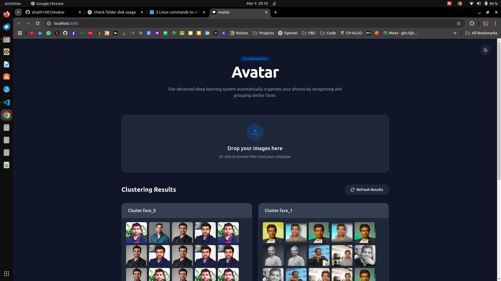
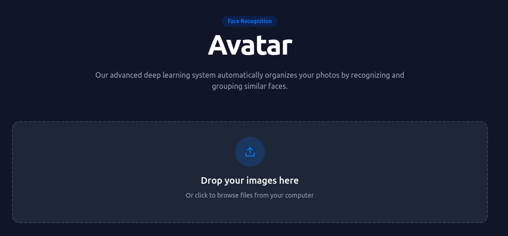
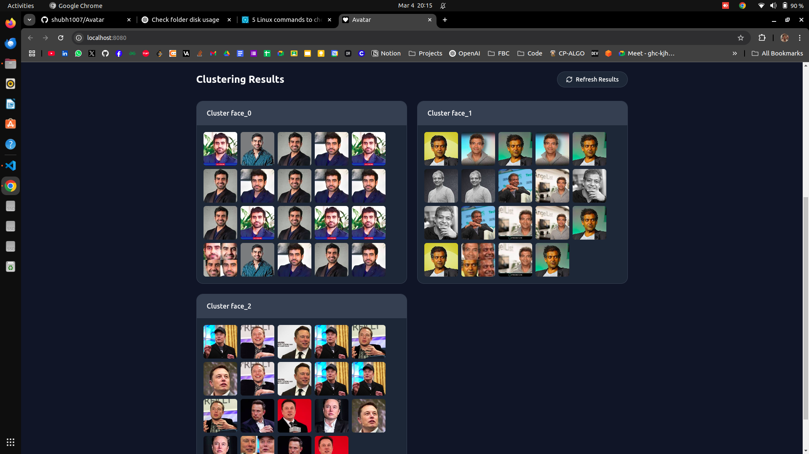

# 🎭 Avatar - AI-Powered Facial Recognition & Clustering

  

## 🚀 About the Project
**Avatar** is an **AI-powered web application** that uses **Deep Learning** to recognize, cluster, and manage large image datasets based on facial features. The frontend is built with **Angular 16** and the backend with **Flask**, leveraging **OpenCV & TensorFlow** for facial recognition.

---

## 🔥 Features
✅ **Facial Recognition** – AI-powered face detection & matching  
✅ **Image Clustering** – Groups similar faces automatically  
✅ **Drag & Drop Upload** – Easy image upload interface  
✅ **Real-Time Preview** – View uploaded images instantly  
✅ **Dark Mode Support** – Switch between light & dark themes  
✅ **Responsive UI** – Works on desktop & mobile devices  

---

## 📸 Screenshots

### 🎬 Working Demo


### 🏠 Home Page


### 📤 Upload Image


### 🔍 Face Clustering


### 🌙 Dark Mode


---

## 📂 Tech Stack
- **Frontend:** ReactJS, TypeScript, 
- **Backend:** Flask, Python, OpenCV, TensorFlow  
- **Database:** MongoDB
<!-- - **Deployment:** Docker, Nginx, AWS/GCP   -->

---

## 🛠️ Installation & Setup

```sh
git clone https://github.com/shubh1007/Avatar.git
cd avatar

cd backend
python -m venv venv
source venv/bin/activate  
pip install -r requirements.txt
uvicorn main:app --reload

cd frontend
npm install
npm run dev
```
